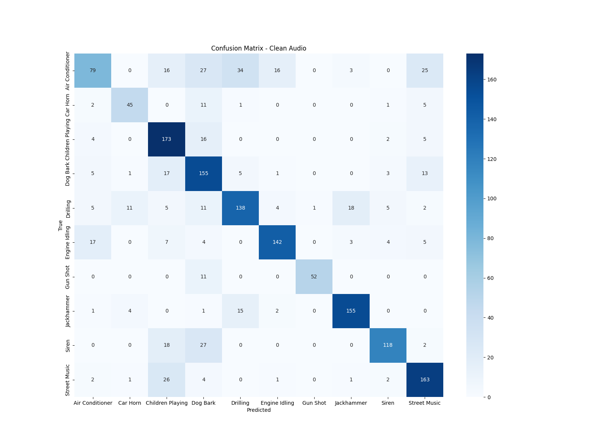
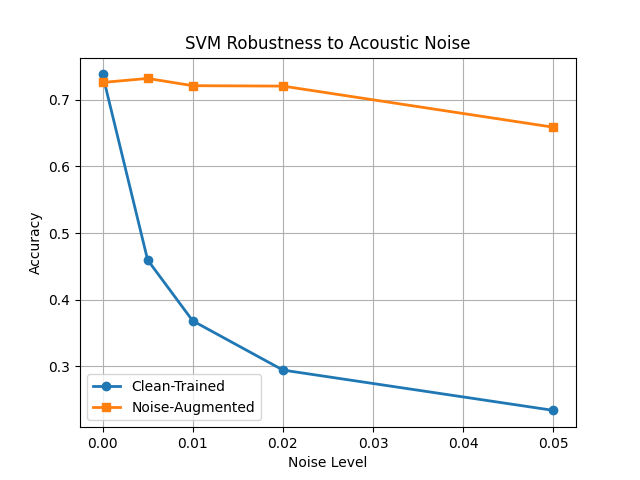

# Robust Acoustic Perception Under Noise

## Overview  

This project evaluates the robustness of **acoustic perception systems** under additive noise using the UrbanSound8K dataset. A classical machine learning pipeline based on **extracted audio features** and an **SVM classifier** is trained on clean audio and noise-augmented data, then systematically evaluated across increasing noise levels.

The goal is to quantify how noise degrades perception performance and demonstrate how **noise-aware training** improves robustness without relying on deep learning models.

## Features  

- **Perceptual Feature Extraction**  
  Extracts a set of time-frequency features including MFCCs with deltas, spectral descriptors, chroma features, zero-crossing rate, and RMS energy.

- **Baseline Acoustic Perception Model**  
  Trains a clean-audio SVM classifier with feature normalization and hyperparameter tuning via cross-validated grid search.

- **Noise-Augmented Training**  
  Expands the training set by injecting controlled Gaussian noise at multiple levels to improve perceptual robustness.

- **Robustness Evaluation**  
  Evaluates both clean-trained and noise-augmented models under progressively increasing noise levels.

- **Caching and Reproducibility**  
  Intermediate feature matrices and trained models are cached to ensure fast reruns and consistent results.

- **Visualization**  
  Generates confusion matrices and accuracy vs noise-level plots to illustrate perception degradation and robustness gains.

## Environmental Audio Perception Pipeline Overview  

This project models environmental audio perception as a supervised classification problem:

1. **Audio Input**  
   Raw environmental audio clips from UrbanSound8K.

2. **Feature Extraction**  
   Each clip is transformed into a fixed-length feature vector capturing:
   - Spectral shape  
   - Temporal variation  
   - Harmonic content  
   - Energy dynamics  

3. **Classification Model**  
   A Support Vector Machine with RBF kernel is trained to map perceptual features to sound class labels.

4. **Robustness Testing**  
   The trained model is evaluated under controlled noise injection to measure perceptual stability.

## Dataset  

- **UrbanSound8K**
- 10 environmental sound classes including air conditioner, car horn, children playing, dog bark, drilling, engine idling, gun shot, jackhammer, siren, street music
- Predefined cross-validation folds are used to ensure consistent train/test splits

**Training Folds:** 1–8  
**Test Folds:** 9–10  

## Clean Audio Performance  

The baseline model is trained using clean audio only and evaluated on the held-out test set.

### Confusion Matrix (Clean Audio)

**Interpretation:**  
The confusion matrix shows strong class separation for many impulsive and high-energy sounds such as *gun shots*, *jackhammer*, and *siren*. Errors are more frequent among acoustically similar classes such as *air conditioner*, *engine idling*, and *drilling*, highlighting intrinsic perceptual ambiguity even under clean conditions.

This matrix serves as a reference point for understanding how noise impacts class-level perception.

## Robustness Under Noise  

To evaluate perceptual robustness, Gaussian noise is added to the test audio at increasing amplitudes. Two models are compared:

- **Clean-Trained Model:** Trained only on clean audio  
- **Noise-Augmented Model:** Trained on clean audio plus noisy variants  

### Accuracy vs Noise Level

**Interpretation:**  
The clean-trained model experiences a rapid decline in accuracy as noise increases, demonstrating the brittleness of perception systems trained under ideal conditions. In contrast, the noise-augmented model maintains significantly higher accuracy across all noise levels.

Key observations:
- Noise-aware training substantially improves robustness
- Performance degradation is smoother and more predictable
- The largest gains occur at moderate noise levels, where real-world systems typically operate

## Key Insights  

- Acoustic perception systems trained only on clean data are highly sensitive to noise
- Simple noise augmentation can dramatically improve robustness without increasing model complexity
- Classical ML pipelines remain competitive and interpretable for perception tasks when carefully engineered

## Project Structure  
src/
- features.py # Audio feature extraction
- data.py # Dataset loading and noise augmentation
- models.py # SVM training utilities
- utils.py # Constants and configuration

scripts/
- train_baseline.py # Train and evaluate clean model
- train_augmented.py # Train noise-augmented model
- evaluate_noise.py # Robustness evaluation and plotting

## Future Work  

- Evaluate robustness to real-world background noise
- Extend to time-localized perception models
- Compare classical features against learned representations
- Apply robustness analysis to multimodal perception systems
